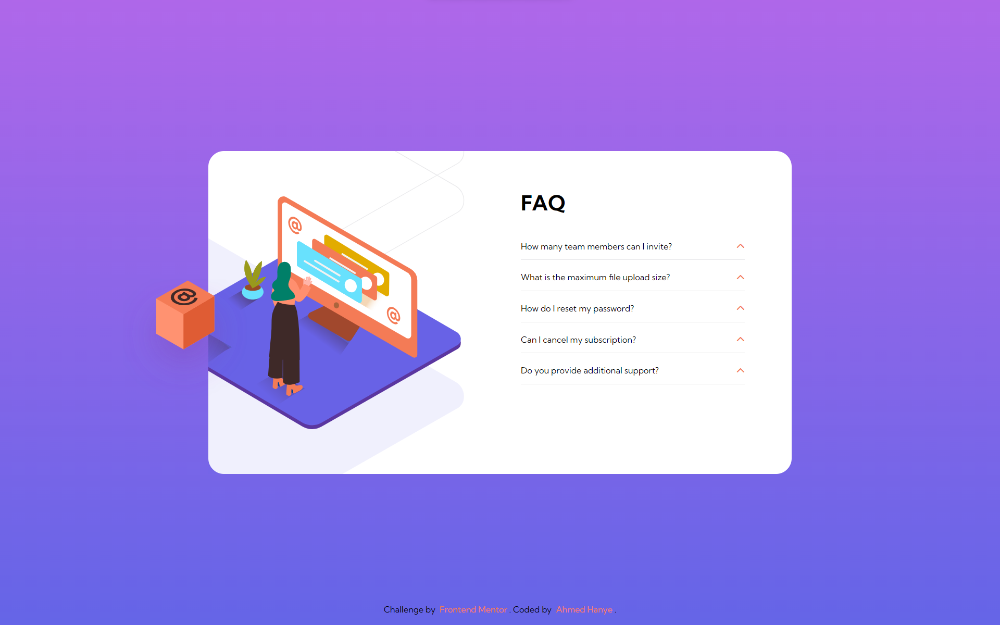

# FAQ Accordion Card

This is a simple FAQ accordion card project created for Frontend Mentor. It includes a responsive webpage with a list of frequently asked questions and answers presented in an accordion format.

link to the website : https://ahmedhanye.github.io/FAQ-accordion-card/

## Features

- Responsive design that adapts to various screen sizes.
- Clicking on a question toggles the display of the corresponding answer.
- Uses HTML, CSS, and JavaScript to create the accordion functionality.
